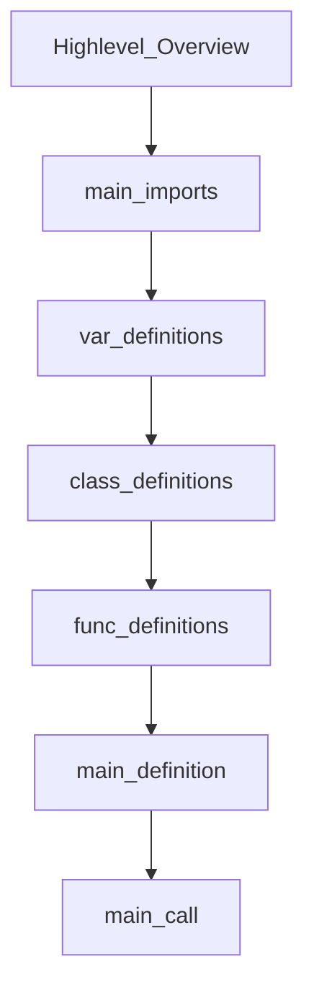
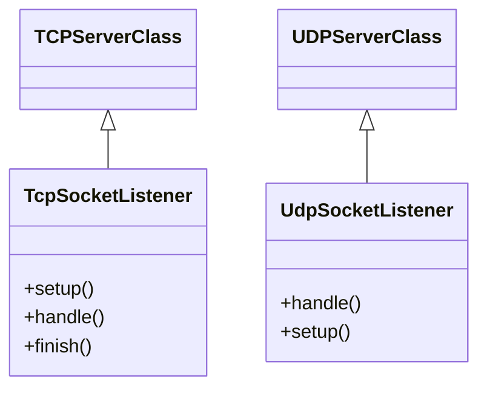

```mermaid
graph TD;
Highlevel_Overview-->main_imports;
main_imports-->var_definitions;
var_definitions-->class_definitions;
class_definitions-->func_definitions;
func_definitions-->main_definition;
main_definition-->main_call;
```

```mermaid
classDiagram
TCPServerClass <|-- TcpSocketListener
UDPServerClass <|--UdpSocketListener
class TcpSocketListener{
+setup()
+handle()
+finish()
}
class UdpSocketListener{
+handle()
+setup()
}
```